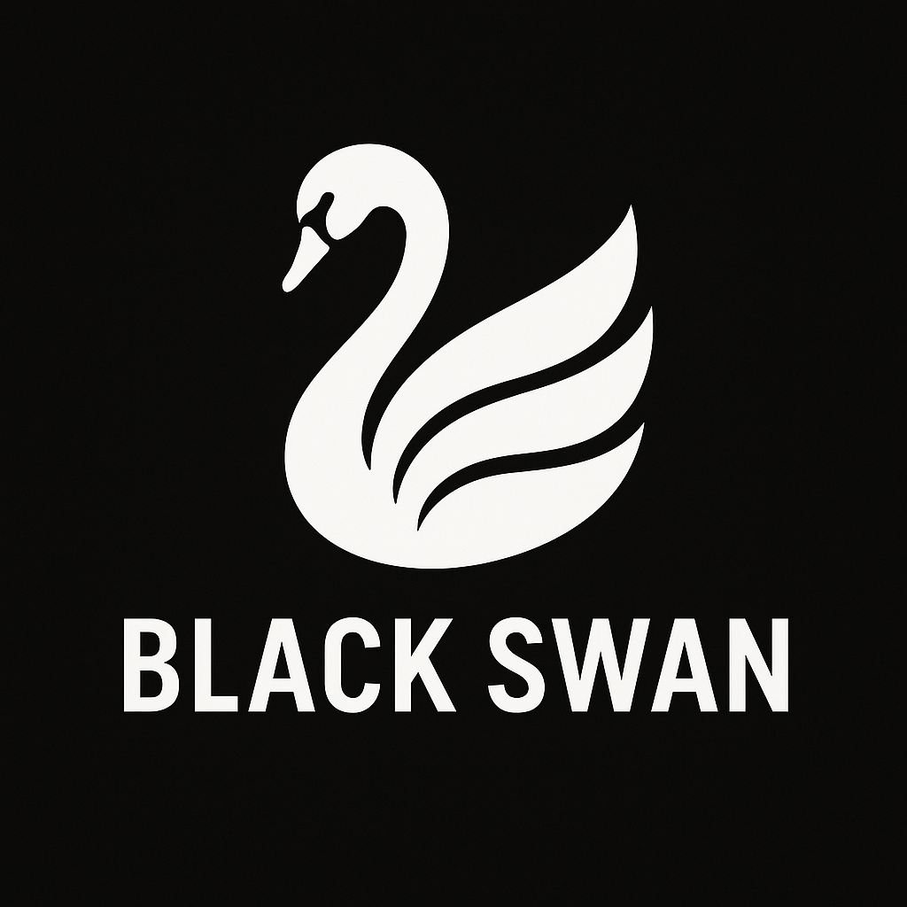

 

# BlackSwan - A Kraken-Exclusive Crypto Trading Bot

Black Swan is a customizable trading strategy manager that lets you build, test, and run trading strategies using Python for strategy logic and Rust for fast, reliable market data from Kraken.

Together, Python and Rust combine to deliver a flexible yet powerful framework that supports both high-level strategy development and low-level system performance.

## Project Overview
Black Swan is a modular trading strategy manager designed for flexibility, performance, and extensibility. It allows users to create custom trading strategies, backtest them on historical data, paper trade in real-time without risking capital, and transition seamlessly into live trading. The platform also provides detailed analytics and performance statistics to help users evaluate and refine their strategies.

The project is built with Python and Rust, combining the ease and flexibility of Python for high-level strategy logic and orchestration, with the speed and safety of Rust for low-level performance-critical components. Python powers the strategy engine, configuration handling, and overall control flow, while Rust is used for communicating with the Kraken exchange, ensuring fast and reliable data fetching for bid/ask prices and other market data.

Black Swan is designed to be lightweight and adaptable—ideal for developers, quant enthusiasts, and traders who want full control over how their strategies are designed, tested, and executed.

## Features

- **Modular Strategy Engine** – Plug-and-play support for custom trading strategies (e.g., RSI, SMA, custom ML).
- **Kraken API Integration** – Built specifically to interface with Kraken's REST and WebSocket APIs.
- **Live & Paper Trading Modes** – Choose between real execution or simulation.
- **Backtesting Engine** – Test strategies against historical Kraken market data.
- **Logging & Performance Analytics** – Track trades, performance, and KPIs over time.
- **Secure Config Management** – Store keys and strategy parameters safely via config files.

---
## Getting Started & Installation 
### Preequisites
- Python 3.10+
- Rust (with `maturin` installed)
- `pip`

### 1. Clone the repository
```bash
git clone https://github.com/GoneInactive/Black-Swan.git
cd black-swan
```

### 2. Set up your virtual enviroment (Optional)
*Note: If step is skipped, issues may arise with running kraken_rust_api*

```bash
python -m venv venv
scoure venv/Scripts/activate 
```

### 3. Install Rust dependencies
```bash
cd rust_client
maturin develop
```

### 4. Install Python dependencies
```bash
cd ..  # If not already in main directory
pip install -r requirements.txt
```

### 5. Get your Kraken api keys
1. Sign into your Kraken account using Kraken pro
2. Click on your profile (top right corner)
3. Select settings
4. Select the `API` tab
5. Click `Create API key`
6. Select appropriate permissions
7. Clcik `Generate key` at the bottom

### 6. Set up your configuration
Open up `config/config.yaml` paste your keys and adjust settings as necessary.

### 7. Run tests (Optional)
In the `config/config.yaml` directory, there are various tests to ensure the program is working properly.
```bash
python tests/(test).py
```

Example:
```bash
python tests/test_rust_client.py
```
---
## Project Structure
---
```
crypto-trading-bot/
├── README.md
├── LICENSE
├── .gitignore
├── requirements.txt / environment.yml
├── config/
│   └── config.yaml
├── data/
│   └── historical/ (or logs/, if storing logs here)
├── logs/
│   └── trade_log.txt
├── models/
│   └── strategy_model.py
├── src/
│   ├── __init__.py
│   ├── main.py
│   ├── trader.py
│   ├── exchange_api.py
│   ├── strategy/
│   │   ├── __init__.py
│   │   ├── moving_average.py
│   │   └── rsi.py
│   ├── utils/
│   │   └── helpers.py
├── tests/
│   ├── test_strategy.py
│   └── test_api.py
└── docs/
    └── architecture.md
```
---
## Python-Rust Integration
Black Swan leverages the power of Rust for performance-critical operations, like interacting with the Kraken API, while Python is used for higher-level strategy development, backtesting, and other logic. This integration combines the best of both languages: Rust for speed and Python for flexibility.

### Rust Functions in Python
Rust functions are exposed to Python via `maturin`, which allows you to build and package Rust extensions into Python modules. For example, functions like `get_bid()` and `get_ask()` retrieve real-time market data from Kraken using Rust’s speed.
* `get_bid()` Fetches the current bid price for the selected trading pair.
* `get_ask()` Fetches the current ask price for the selected trading pair.

### Building the Rust Extension
To build the Rust extension and make it available for Python, use the following command:
```bash
maturin develop
```

### Example
```python
from rust_kraken_client import get_bid, get_ask

def test_rust_integration():
    print("Bid price:", get_bid())  # Call the Rust function to get the bid
    print("Ask price:", get_ask())  # Call the Rust function to get the ask

if __name__ == "__main__":
    test_rust_integration()
```

### Managing Kraken API Requests
Rust handles the Kraken API requests efficiently. When you call functions like `get_bid()` or `get_ask()`, they internally handle API requests, error handling, and response parsing, ensuring high performance.
---
## Troubleshooting
Will update as common problems arise.

